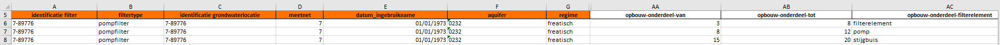

# Script voor conversie van Excel data naar DOV XML-formaat

## Stap 1: Download en installeer Python

Het script is geschreven in python. Om dit op jouw computer te kunnen uitvoeren, moet je Python geïnstalleerd hebben staan. Geen zorgen, dit is een simpele procedure, en je zal er verder niks van merken.

Als je nog geen Python hebt geïnstalleerd op je systeem, volg dan deze stappen:

1.  Ga naar de officiële Python-website op [python.org](python.org).
2.  Klik op de "Downloads" knop in het menu.
3. Kies de versie van Python die overeenkomt met je besturingssysteem (meestal wordt de nieuwste stabiele versie aanbevolen).
4. Download het installatiebestand en voer het uit.
5. Volg de installatie-instructies op het scherm.

Alternatief kan je als je Windows 10 gebruikt, Python eenvoudig installeren via de Microsoft Store:

1. Open de Microsoft Store-app op je Windows 10-computer.
2. Zoek naar "Python" in de zoekbalk van de Microsoft Store.
3. Klik op de recentste versie van Python die wordt weergegeven in de zoekresultaten.
4. Klik op de knop "Installeren" om de installatie te starten.
5. Volg de instructies op het scherm om de installatie te voltooien.

## Stap 2: Download het script

Klik op de [github pagina](https://github.com/DOV-Vlaanderen/xls2xml) rechtsboven op download en download de bestanden in een zip formaat. Pak vervolgens het zip bestand uit op je computer.
Ben je meer gevorderd met git en github, dan kan je ook altijd de repo forken.

Heb je het script reeds aangeleverd gekregen als zip bestand? Kijk dan zeker op de githubpagina naar de datum van de laatste update. Indien het script recent geupdated is geweest, download je best de nieuwste versie van het script.  
<br>

## Stap 3: Data voorbereiden

Het script vergt aangeleverde data in het juiste formaat. In de map data vind je de Excel-template (template.xlsx) die nodig is voor het aanleveren van de data.

Vul het Excel-bestand in met de data die je in DOV wenst toe te voegen. 
In het excel bestand zijn enkele gegevensvalidaties aanwezig. Zo zijn enkel datums later dan 01/01/1900 toegelaten in velden waar een datum wordt verwacht.
Ook zijn er enkele velden waar de optie uit een codelijst moet komen. Deze zijn makkelijk zichtbaar aan de verwijzing in de kolomnamen, die rechtstreeks verwijzen naar de relevante codelijst op het Excel-blad "Codelijsten".

Wanneer over een bepaald object meerdere rijen aan gegevens moeten ingevuld worden, dan kan dit door de gegevens in de verplichte velden te dupliceren naar de onderstaande rijen en vervolgens de gegevens in de corresponderende kolom toe te voegen.
Een voorbeeld van dit proces wordt weergegeven in onderstaande afbeelding:



## Stap 4: Het script uitvoeren

Het script kan uitgevoerd worden met een commando in de terminal. Dit kan op verschillende manieren:
<br>

### Stap 4.1a: Een terminal openen voor Windows gebruikers

Open je Windows verkenner. Houdt de `SHIFT` toets ingedrukt en rechtermuisklik op de map met het main script. Er verschijnt een menu, en kies voor de optie 'Open PowerShell venster'.

### Stap 4.1b: Een terminal openen voor MacOS gebruikers

Open Finder. Rechtermuisklik op de map met het main script. Er verschijnt een menu, en kies voor de optie 'Nieuwe terminal op Map'.  
<br>

### Stap 4.2: Packages installeren

Om het script uit te kunnen voeren moeten er nog een aantal extensies geïnstalleerd worden. Dit kan je eenvoudigweg doen door in de terminal die hebt openstaan de volgende commando's uit te voeren (typ het commando en druk op Enter):
```
python.exe -m pip install --upgrade pip
pip install -r requirements.txt
```
<br>

### Stap 4.3: Het script uitvoeren

Nu je een terminal hebt open staan, kan je een van volgende commando's uitvoeren (typ het commando en druk op Enter):

```
python xls2xml.py
```

<br>
Wanneer het script klaar is, worden de xml bestanden toegevoegd aan de map 'dist'. Indien er zich errors voordoen, krijg je die te zien.

### Stap 4.3a: Geavanceerd gebruik

Het is mogelijk om enkele opties aan deze functie toe te voegen:

```
usage: xls2xml [-h] [-i INPUT_FILE] [-o OUTPUT_FILE]
               [-s SHEETS [SHEETS ...]]

Function to parse data from xlsx-files to XML ready to be uploaded
in DOV

options:
  -h, --help            show this help message and exit
  -i INPUT_FILE, --input_file INPUT_FILE
                        Input xlsx file that will be parsed to XML,
                        default: data/template.xlsx
  -o OUTPUT_FILE, --output_file OUTPUT_FILE
                        Output file to which the parsed XML-file is
                        outputted, default: dist/dev.xml
  -s SHEETS [SHEETS ...], --sheets SHEETS [SHEETS ...]
                        Sheet(s) from excel file that needs to be
                        parsed, by default all sheets will be
                        parsed
```